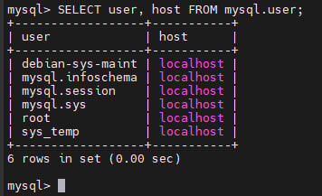
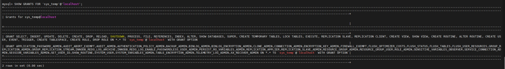
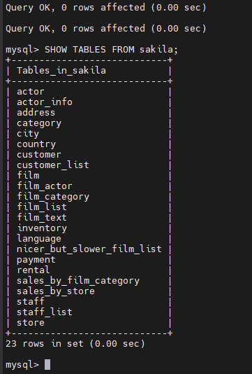
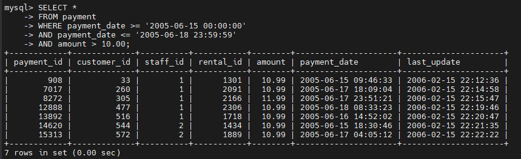

# Домашнее задание к занятию «Работа с данными (DDL/DML)» - Макану Александр


### Задание 1

```sql
CREATE USER 'sys_temp'@'localhost' IDENTIFIED BY 'password';

SELECT user, host FROM mysql.user;

GRANT ALL PRIVILEGES ON *.* TO 'sys_temp'@'localhost' WITH GRANT OPTION;
FLUSH PRIVILEGES;

SHOW GRANTS FOR 'sys_temp'@'localhost';

SOURCE /home/osboxes/sakila-db/sakila-schema.sql;
SOURCE /home/osboxes/sakila-db/sakila-data.sql;

SHOW TABLES FROM sakila;







### Задание 2

